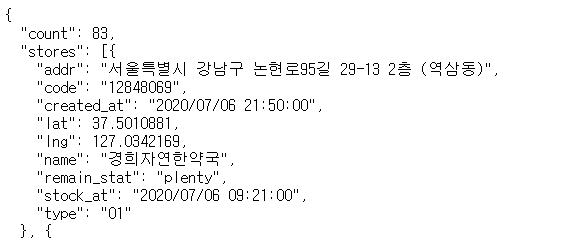

## Hexlant 
Hexlant 산학 일지  
---
2020.
---
# 7. 6. Mon : 간단한 request 예제  
1. openAPI
- API(Application Programming Interface)  
- _**응용프로그램**에서 사용할 수 있도록, **운영체제나 프로그래밍 언어가 제공하는 기술**을 제어할 수 있게 만든 인터페이스_  
- UI가 사용자와 대상을 연결한다면, API는 서로 다른 프로그램 사이를 연결해주는 다리,,
- **응용프로그램**이 우리가 만든 application이라면 **운영체제나 프로그래밍 언어가 제공하는 기술**은 sk 날씨정보나 카카오페이!!
- openAPI는 말그대로 **open**돼있는 API  

    
- dictionary 형태로 값들이 들어있는 걸 확인할 수 있음!!  
  
---
2. python 가상환경(virtual environment)  
- 여러 프로젝트 개발 시 패키지 호환문제 발생,, 이를 해결하기 위해 python에서는 가상환경을 제공해 독립된 공간을 제공  

```
// 마지막 인자 venv는 파일 이름으로 변경 가능  
window: python -m venv venv
```  
- 만약 에러("...스크립트를 실행할 수 없다...")가 발생한 경우

```
Set-ExecutionPolicy Unrestricted -Scope CurrentUser
```

- 위 command 입력 후 다시 실행. 이걸로 해결안되면 Set-ExecutionPolicy Unrestricted같은 다른 command 사용,,  
---  
3. request library
- python에서 HTTP requeset를 처리할 수 있는 묘듈

```
pip install requests
```    

  
---
4. example (source code: openAPI_request.py)  
```
r = requests.get('https://8oi9s0nnth.apigw.ntruss.com/corona19-masks/v1/storesByGeo/json')
rjson = r.json()
stores = rjson['stores']
for store in stores:
    try:
        if store['remain_stat'] == 'plenty':
            print(store['addr'],store['name'])
    except:
        continue
```  

```
서울특별시 강남구 논현로95길 29-13 2층 (역삼동) 경희자연한약국  
서울특별시 강남구 논현로 561 1층 (역삼동) 비타약국  
서울특별시 강남구 논현로 503 703-1호 (역삼동, 송촌빌딩) 세코아약국  
서울특별시 강남구 논현로 509 1층 1호 (역삼동) 팜스약국  
서울특별시 강남구 논현로 511 3층 (역삼동, YandC빌딩) 다정온누리약국  
서울특별시 강남구 논현로 521-3 1층 (역삼동) 역삼다인약국      
서울특별시 강남구 테헤란로28길 5 1층 일부호 (역삼동) 샬롬온누리약국  

중략,,,

``` 
--- 