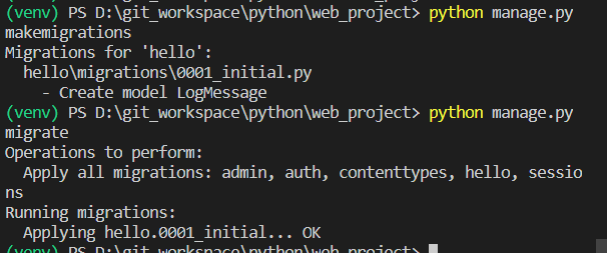

## Hexlant 
Hexlant 산학 일지  
---
2020.
---
# 7. 6. Mon : 간단한 request 예제  
1. openAPI
- API(Application Programming Interface)  
- _**응용프로그램**에서 사용할 수 있도록, **운영체제나 프로그래밍 언어가 제공하는 기술**을 제어할 수 있게 만든 인터페이스_  
- UI가 사용자와 대상을 연결한다면, API는 서로 다른 프로그램 사이를 연결해주는 다리,,
- **응용프로그램**이 우리가 만든 application이라면 **운영체제나 프로그래밍 언어가 제공하는 기술**은 sk 날씨정보나 카카오페이!!
- openAPI는 말그대로 **open**돼있는 API  

    
- dictionary 형태로 값들이 들어있는 걸 확인할 수 있음!!  
  
---
2. python 가상환경(virtual environment)  
- 여러 프로젝트 개발 시 패키지 호환문제 발생,, 이를 해결하기 위해 python에서는 가상환경을 제공해 독립된 공간을 제공  

```
// 마지막 인자 venv는 파일 이름으로 변경 가능  
window: python -m venv venv
```  
- 만약 에러("...스크립트를 실행할 수 없다...")가 발생한 경우

```
Set-ExecutionPolicy Unrestricted -Scope CurrentUser
```

- 위 command 입력 후 다시 실행. 이걸로 해결안되면 Set-ExecutionPolicy Unrestricted같은 다른 command 사용,,  
---  
3. request library
- python에서 HTTP requeset를 처리할 수 있는 묘듈

```
pip install requests
```    

  
---
4. example (source code: openAPI_request.py)  
```
r = requests.get('https://8oi9s0nnth.apigw.ntruss.com/corona19-masks/v1/storesByGeo/json')
rjson = r.json()
stores = rjson['stores']
for store in stores:
    try:
        if store['remain_stat'] == 'plenty':
            print(store['addr'],store['name'])
    except:
        continue
```  

```
서울특별시 강남구 논현로95길 29-13 2층 (역삼동) 경희자연한약국  
서울특별시 강남구 논현로 561 1층 (역삼동) 비타약국  
서울특별시 강남구 논현로 503 703-1호 (역삼동, 송촌빌딩) 세코아약국  
서울특별시 강남구 논현로 509 1층 1호 (역삼동) 팜스약국  
서울특별시 강남구 논현로 511 3층 (역삼동, YandC빌딩) 다정온누리약국  
서울특별시 강남구 논현로 521-3 1층 (역삼동) 역삼다인약국      
서울특별시 강남구 테헤란로28길 5 1층 일부호 (역삼동) 샬롬온누리약국  

중략,,,

``` 
---  
# 7. 7. Tue : 간단한 Django project
1. Django
- Django는 웹 개발에 사용되는 python web framework,,
- 본격적으로 시작하기 전, Django를 설치해야 함
```
python -m pip install django  
```
---
2. Django Project 생성
- 아래 command로 project 생성  
'''  
django-admin startproject web_project .
'''
- startproject는 현재 폴더에 project를 생성함을 의미.  
- ~~원래 마지막 . 을 찍어야 된다는데 나는 안찍었던 것 같은데 잘됐다,,~~  
- web_project는 project이름,,  
- command 입력하면 web_project 폴더가 생기는데 안에 python file은 차차 알아볼 것. 일단 작동 방식은 아래와 같음.  

  

- **가상환경이 활성화 돼있는지 꼭 확인할 것!!**  
---
3. server 실행
- 아래 command로 server 실행
```
#default로 port가 8000
python manage.py runserver

#port값을 변경하고 싶다면 맨 뒤에 option값 추가
python manage.py runserver 5000
```  


- **아니 근데 오류 발생,,**
- 우선 터미널에 나온대로 python manage.py migration 해줘도 오류가 발생함  
- 오류를 보니까 server를 여는 과정에서 hostname을 받아오는데 이때 **UnicodeDecodeError**가 발생  
- hostname이 한글로 돼있어서 발생하는 문제;; 아래 명령어를 cmd에 입력해 hostname을 바꿔야함.  
```
wmic ComputerSystem Where Name="%COMPUTERNAME%" Call Rename Name="원하는 호스트 명 영어로,,"  

결과값으로 ReturnValue = 0이 아니라면 hostname이 바뀌지 않은 것!
```
- 본인은 바뀌지가 않아서 직접 바꿔주었다.

```
제어판 >> 시스템 및 보안 >> 시스템 >> 설정 변경 >> 변경  
에서 직접 이름 변경

```
- **변경 후 재부팅해서 적용됨**
- 실행 후 터미널에 http://127.0.0.1:8000/을 타고 들어가면 아래 화면을 확인할 수 있음~!  
  

---
4. Django app 생성
- 본격적으로 web을 꾸려보자  
```
#hello는 app이름( 변경가능 )
python manage.py startapp hello
```
- web_project 파일 아래 hello 파일이 생긴 걸 확인할 수 있음  
- views.py는 내 web application의 page를 정의  
<br>

- hello/urls.py 파일 만들기
```
from django.urls import path
from hello import views

urlpatterns = [
    path("", views.home, name = "home"),
]
```
- 여기서 내 web application의 route을 정의해주는 것
- 첫번 째인자는 route에 해당
- 여기서는 URL pattern을 빈 문자열에 매칭
- **Django URL resolver는 전체 URL pattern에서 prefix에 포함된 도메인 네임을 무시!!** 따라서 해당 route는 http://127.0.0.1:8000/에 대응
- 두번째 인자인 views.home은 views에 정의된 함수 home을 해당 url path로 이동했을 때 불러옴. **즉 http://127.0.0.1:8000/에 접속했을 때, views.home을 띄어주는 것!!**
- [세번 째 인자](https://docs.djangoproject.com/en/3.0/topics/http/urls/#naming-url-patterns)는 URL reversing에 쓰인단다,,
<br>

- views.home
```
def home(request):
    return HttpResponse("Hello, Django!")
```
- hello/views.py안에 "Hello, Django!"라는 content을 response해주는 간단한 view를 정의함  
- 결과창~!~!  
  

---
5. Explore
- hello/urls.py에 rouute 추가
- **추가할 때 ","로 추가,,,**
```  
path("hello/<name>", views.hello_there, name="hello_there")
```
- route에서 hello/뒤에 name을 string 변수로 받아와 route를 정의한다.
- 즉 `http://127.0.0.1:8000/hello/`*name* 으로 route 정의
- **route는 case sensitive!!**  

- 여기서 name을 어디서 받아오는 건지 약간 헷갈렸으나 주소값 입력에서 hello/뒤에 붙은 값을 name이라는 변수로 받아오는 것!
- 다시말해 http://127.0.0.1:8000/hello/hexlant 로 받았다면 hexlant가 name으로 넘어오는 것.
- 따라서 **re.match해줘야 함**. user-provided information에 HTML의 control charactor 등이 들어가 문제가 생길 수 있음
- 때문에 filter해주는 작업이 필요,,!
- 아래는 views.hello_there
```
def hello_there(requset, name):

    중략,,  

    match_object = re.match("[a-zA-Z]+", name)

    중략,,  
```  
- name을 hello_there에서 인자로 받아옴

---
6. Template
- plane한 text web page를 바꿔보자
- content = "`<h1>`Hello there"!`<h1>`과 같이 HTML을 활용해 직접 전달할 경우 [cross-site scripting(XSS) attacks](https://en.wikipedia.org/wiki/Cross-site_scripting)에 위험
- 따라서 template을 활용하는 것!
- template은 쉽게 말해 HTML파일임
<br>

- 먼저 web_project/settings.py에 INSTALLER_APP에 다음을 추가한다.
```
'hello'
```  
- project가 app을 인식할 수 있도록 추가해주는 것,,

<br>

- hello 폴더에 templates이라는 폴더를 만들고 안에 app과 똑같은 이름('hello')의 서브폴더를 생성한다. ~~convention이란다~~

<br>

- /templates/hello에 hello_there.html 파일 생성
```
    <body>
        <strong>Hello there, {{ name }}!</strong> It's {{ date | date:"l, d F, Y" }} at {{ date | time:"H:i:s" }}
    </body>
```
- 여기서는 2개의 placeholder를 포함. 1개는 name, 다른 1는 date 각각 {{ }}로 묶어 있음!
- pipe symbol(|)뒤에 값은 [date filter](https://docs.djangoproject.com/en/2.1/ref/templates/builtins/#date), [time filter](https://docs.djangoproject.com/en/2.1/ref/templates/builtins/#time)참고!

<br>

- views.hello_there 수정!!
```
def hello_there(requset, name):
    return render(
        requset,
        'hello/hello_there.html',
        {
            'name': name,
            'date': datetime.now()
        }
    )
```  
- **이전처럼 content를 직접 넘겨줄 필요없음!**
- render로 request object, template path, 필요한 data를 가져가 template를 load하는 방식,,

<br>

--- 
7. 참고
- name에서 `<a%20value%20that%20could%20be%20HTML>`라는 HTML context를 직접 넘겨도 name은 plain text로 표시됨!

---
8. 간단한 과제,,
- 위에서 한 내용을 그대로 따라해서 매우매우 간단간단한 자기소개 page도 만들었다,,
- hello/urls.py
```
 path("introduction", views.self_introduction, name="self_introduction")
```
- hello/views.py
```
def self_introduction(request):
    '''
    content = "Hello there, I'm Lee-Minseoung!\n"
    return HttpResponse(content)
    '''
    return render(
        request,
        'hello/self_introduction.html'
    )
```
- templates/hello/self_introduction.html
```
<!DOCTYPE html>
<html>
    <head>
        <meta charset="utf-8" />
        <title>Hello, Django</title>
    </head>
    <body>
        <strong>Hello there!</strong> I'm Lee-Minseoung
    </body>
</html>
```
---
# 7. 8. Wen : Django Project 마무리
1. static files  
- pieces of content that web app returns ex)이미지, JavaScript, CSS  
- 더 참고할 [자료](https://docs.djangoproject.com/en/2.1/howto/static-files/)  
- web_project/settings.py에서 **DEBUG=False**로 설정해야함
- **이때 Docker같은 container를 사용할 경우, static file을 불어오지 못함**[(참고)](https://github.com/Microsoft/python-sample-vscode-django-tutorial/issues/13)
---  
2. static file 사용
- 먼저 web_project/settings.py 안에 INSTALLED_APPS에 app이름 추가  
```
'hello'
```  
- **이렇게 함으로 static file을 찾을 수 있게 해줌**
- 다음 web_project/urls.py에 다음을 추가
```
from django.contrib.staticfiles.urls import staticfiles_urlpatterns

urlpatterns += staticfiles_urlpatterns()

```
- *staticfile_urlpatterns*는 helper function으로 standard static files의 url patterns을 return해주는 함수  
- hello 밑에 static 폴더를 만들고 안에 다시 app 이름과 같은 서브폴더를 만들어줌
- **같은 프로젝트에 여러 app을 사용하기 때문에 확실히 해줄 필요!!!**  

- static/hello 밑에 [css 파일](https://github.com/dlalstjd/Hexlant/blob/master/web_project/hello/static/hello/site.css) 만들어줌,,
- 안드로이드 스튜이도 xml파일 처럼 web을 꾸며준다고 생각하면 쉬울듯  
- templates/hello/hello_there.html 수정  
```
<!DOCTYPE html>
<html>
    <head>
        <meta charset="utf-8" />
        <title>Hello, Django</title>
        
        <link rel="stylesheet" type="text/css" href="" />
    </head>
    <body>
        <span class="message">Hello there, {{ name }}!</span> It's {{ date | date:"l, d F, Y" }} at {{ date | time:"H:i:s" }}.
    </body>
</html>
```
-  tag는 이 부분에서 static file을 사용하겠다는 선언으로 생각하면 될 듯  
- 에서 해당 static file의 url을 생성해서 묶어주는 것,,  
---  
3. collectstatic  
- collect all the static files from your app into a single folder..  
- ~~사실 왜 하는지는 잘 모르게따이~~  
- 먼저 web_project/settings.py에 추가  
```
STATIC_ROOT = os.path.join(BASE_DIR, 'static collected')
```
- 실행 command  

```  
python manage.py collectstatic
```
- **static file을 수정하거나 server 돌리기 전에 습관처럼 하란다**
---
4. Base page & Extended page  
- base page는 여러 page에서 공통적으로 사용하는 view를 정의해놓은 page, ~~parent class같은 느낌~~  
- 여기서는 [layout.html](https://github.com/dlalstjd/Hexlant/blob/master/web_project/hello/templates/hello/layout.html)을 base page로 사용함  
- 사용하려면 먼저 code sinnpet을 설정해줘야함  
```
#vscode를 사용함  
오른쪽 상단에 tool bar에서 파일 >> 기본설정 >> 사용자 코드 조작 >> html 클릭  
#이렇게 하면 html.json 파일이 만들어짐  
#다음 내용 추가  
"Django Tutorial: template extending layout.html": {
    "prefix": "djextlayout",
    "body": [
        "",
        "",
        "$0",
        "",
        "",
        ""
    ],

    "description": "Boilerplate template that extends layout.html"
},
```
- 이렇게 하면 다른 html 파일에서 dj만 쳐도 자동완성됨ㅎ  개꿀  

<br>

- 이렇게 만든 base page로 extended page를 만들어 보자  
- templates/hello 밑에 home.html을 만들어준 뒤 dj만 치면 나오는 걸로 자동완성 해줌  
- 여기서 위에서 추가한 것처럼 {%block `<name>`} & 으로 block이 형성됨  
- title block안에 넣는 내용이 title이 되는 방식!!  
---
5. database를 사용해보자  
- Django에서는 **models.py**로 DB를 다룸!  
- DB object, 즉 table을 다룬다고 생각하면 됨  
- models.py에서 사용하고자 하는 data의 형태(model)을 정의해놓은 뒤, migration시켜주면 sql을 사용하지 않고도 query를 다룰 수 있는 방식.  

<br>

- 간단한 실험  
- 처음에는 잘 이해가 안돼 model과는 전혀 상관없는 print를 넣고 migration해봤다.  
  
- 그러고 migration해봤다  
```
python manage.py makemigrations  

python manage.py migrate  
```  
- 결과!
  

  
- 실행시켜보니 test가 출력되는 걸 확인했고  
- No migrations to apply가 떴다.  아마 적용할 model rule이 없어서 그런가 보다  

<br>  

- models.py에 model만들기 [참고](https://docs.djangoproject.com/en/2.1/ref/models/fields/) 
- page에서 Log를 보내서 보낸 Log를 저장해보자  

```
class LogMessage(models.Model):
    message = models.CharField(max_length=300)
    log_date = models.DateTimeField("date logged")

    중략,,  
```  
- message는 맥스 길이가 300인 문자열, log_date는 datetime이라는 형식으로 model을 만든다  
- 이후 migration!  
  
- 아까와 다르게 뭔가 적용된 걸 확인할 수 있다~!!~!  
- SQLite browser로 DB에 들어있는 data를 확인  
  
- 형식과 내용도 잘 저장해준다ㅋㅎㅋ  